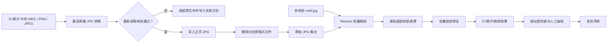

# 藏服照片 JPG 归一化与 ComfyUI 批量换脸设计

## 1. 目标

处理 `D:\照片` 中的个人写真：

1. 将非 JPG 照片转为最高质量 JPG；
2. 仅在转换成功并重新读取核验后，删除对应原格式文件；
3. 使用 `D:\照片\参考脸\me0.jpg` 作为统一参考脸，在 ComfyUI 中批量处理藏服照片；
4. 仅替换五官和脸型，保留藏式头饰、发型、辫发、服装、身体姿态和背景；
5. 原始 JPG 始终保留，换脸结果另存。

照片与参考脸均由用户确认用于个人、非商业用途。

## 2. 已确认的输入

- 照片目录：`D:\照片`
- 当前照片统计：
  - 45 个 `.HEIC`
  - 4 个 `.PNG`
  - 1 个 `.JPEG`
  - 2 个已有 `.jpg`
- 参考脸：`D:\照片\参考脸\me0.jpg`
- 参考脸特点：仅有一张半侧脸照片
- 目标照片：均为单人照片，不存在多人合照
- 硬件：NVIDIA GeForce RTX 3090，24 GB VRAM
- ComfyUI：本机尚未发现现有安装，计划安装至 `D:\ComfyUI`

## 3. 选定方案

采用两阶段批量方案：

1. 使用 ComfyUI ReActor 节点进行统一参考脸批量换脸；
2. 使用紧贴面部轮廓的遮罩和轻量脸部修复，仅优化换脸区域；
3. 生成相似度结果、失败日志和复检清单；
4. 将复杂角度、遮挡、低光和低相似度照片留给后续人工复检。

不将生成式局部重绘作为第一轮批量方案，因为它更容易误改藏式头饰和发型。

## 4. 目录设计

### 4.1 输入与归一化

- 输入目录：`D:\照片`
- 参考脸目录：`D:\照片\参考脸`
- JPG 输出：与对应原照片位于同一目录，文件名保持一致，仅扩展名改为 `.jpg`

示例：

```text
D:\照片\IMG_9131.HEIC
→ D:\照片\IMG_9131.jpg
```

### 4.2 换脸输出

- 换脸结果：`D:\照片\换脸结果`
- 日志和复检清单：`D:\照片\换脸结果\logs`
- ComfyUI 安装目录：`D:\ComfyUI`

换脸阶段不覆盖 `D:\照片` 中的原始 JPG。

## 5. 组件

### 5.1 JPG 归一化脚本

职责：

- 递归扫描支持的非 JPG 图片；
- 对 HEIC、PNG、JPEG 等格式进行转换；
- 使用最高 JPEG 质量参数；
- 保留原分辨率和可用 EXIF 信息；
- 写入临时文件并重新读取核验；
- 核验成功后将临时文件改名为正式 `.jpg`；
- 正式 JPG 写入成功后删除对应原格式文件；
- 若转换、核验或删除失败，记录日志并保留原文件。

### 5.2 ComfyUI

职责：

- 提供可视化节点工作流和批量执行入口；
- 使用 RTX 3090 运行本地推理；
- 保留可调整参数，方便后续处理复杂角度照片。

### 5.3 ReActor 换脸节点

职责：

- 使用统一参考脸处理单人照片；
- 限定目标人脸索引为首个检测到的人脸；
- 仅处理检测到的面部区域；
- 输出换脸结果和相似度信息。

参考：<https://github.com/Gourieff/ComfyUI-ReActor>

### 5.4 面部遮罩与轻量修复

职责：

- 遮罩尽量贴合脸部轮廓；
- 避免遮罩扩展至头饰、发型和辫发；
- 仅对换脸区域进行轻量修复；
- 不改变服装、身体姿态和背景。

## 6. 数据流



## 7. 安全边界

### 7.1 原格式文件删除条件

仅当以下条件全部满足时删除原格式文件：

1. JPG 已写入临时文件；
2. 临时 JPG 可以被重新读取；
3. JPG 尺寸与原图一致；
4. JPG 像素有效；
5. 临时 JPG 已成功改名为正式文件。

若正式 `.jpg` 已存在，不覆盖、不删除原文件，记录为冲突项。

### 7.2 换脸阶段安全边界

- 原始 JPG 永不覆盖；
- 换脸失败不影响原始 JPG；
- 输出只写入 `D:\照片\换脸结果`；
- 参考脸目录不参与换脸目标扫描；
- 任何无人脸、检测失败或节点执行失败的文件都进入日志。

## 8. 验收标准

### 8.1 JPG 转换

- 50 个待转换文件均有明确结果：成功、冲突或失败；
- 成功项均生成可重新读取的 JPG；
- 成功项保持原始像素尺寸；
- 成功项的原格式文件已删除；
- 失败项和冲突项的原格式文件仍保留；
- 已有 JPG 不被修改。

### 8.2 ComfyUI 换脸

- ComfyUI 可在本机启动；
- ReActor 工作流可载入；
- `me0.jpg` 可作为统一参考脸；
- 换脸结果只写入 `D:\照片\换脸结果`；
- 抽检时头饰、发型、辫发、服装、身体和背景不应出现明显改动；
- 生成失败日志和复检清单。

## 9. 已知限制

- 参考脸只有一张半侧脸照片；
- 与参考角度接近的照片预期效果最好；
- 正脸、反方向侧脸、面部遮挡、低光、头饰遮盖脸部边缘等照片可能需要复检；
- ReActor 仓库说明其预训练模型存在非商业研究用途限制，本次用途已确认是个人、非商业用途。

## 10. 后续实施顺序

1. 编写并验证 JPG 归一化脚本；
2. 执行格式转换，核验后删除成功项的原格式文件；
3. 安装 ComfyUI 至 `D:\ComfyUI`；
4. 安装 ReActor 及所需模型；
5. 创建可载入的批量换脸工作流；
6. 使用少量样本验证遮罩范围和输出质量；
7. 批量执行并生成复检清单。
