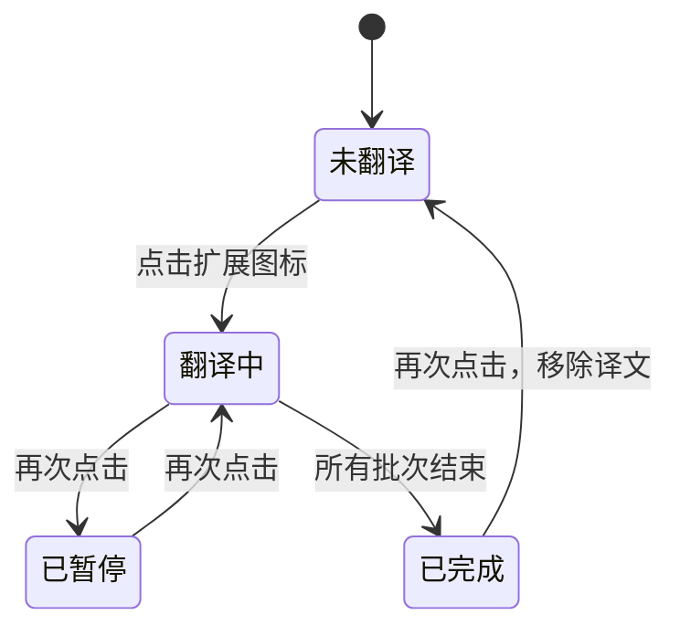

# 本地大模型沉浸式网页翻译 Chrome 扩展设计

## 1. 目标

创建一个 Chrome 扩展，实现类似沉浸式翻译的网页段落双语对照阅读体验：

1. 用户点击扩展图标后，翻译当前网页；
2. 自动识别网页原语言，统一翻译为简体中文；
3. 保留网页原文，在每个正文段落后插入对应译文；
4. 只调用本机大模型，不上传网页内容；
5. 首版保持聚焦，不支持 PDF、字幕、输入框翻译和划词弹窗。

## 2. 已检测到的本地模型接口

- 接口类型：OpenAI 兼容接口
- Base URL：`http://127.0.0.1:8080/v1`
- 模型：`gemma.gguf`
- 已验证：`GET http://127.0.0.1:8080/v1/models` 返回 HTTP 200，并列出 `gemma.gguf`

扩展设置页允许用户修改 Base URL 和模型名称。

## 3. Chrome 扩展平台约束

扩展使用 Manifest V3：

- 后台逻辑使用 service worker；
- 网页读取和译文插入使用 content script；
- content script 运行在独立隔离环境；
- 扩展后台通过 host permission 请求本机模型接口；
- 配置使用 `chrome.storage.local` 保存；
- 不加载远程 JavaScript，不执行远程代码。

Chrome 官方参考：

- Manifest V3：<https://developer.chrome.com/docs/extensions/develop/migrate/what-is-mv3>
- content scripts：<https://developer.chrome.com/docs/extensions/reference/manifest/content-scripts>
- permissions：<https://developer.chrome.com/docs/extensions/develop/concepts/declare-permissions>
- storage：<https://developer.chrome.com/docs/extensions/reference/api/storage>

## 4. 选定方案

采用 **MV3 分批段落翻译**：

1. 用户点击扩展图标；
2. service worker 向当前标签页 content script 发送切换命令；
3. content script 提取当前页面可见正文段落；
4. content script 将段落按批次发送给 service worker；
5. service worker 调用本机 OpenAI 兼容接口；
6. content script 将译文紧跟插入对应原文段落；
7. 页面右下角显示进度；
8. 再次点击扩展图标可暂停翻译，或在已完成后移除译文。

选择此方案的原因：

- 体验接近沉浸式翻译；
- 本机模型请求由扩展后台发起，不依赖网页自身的 CORS 策略；
- 网页内容只发送给 `127.0.0.1`；
- 可以逐批返回结果，避免大页面长时间无反馈。

## 5. 功能范围

### 5.1 首版包含

- 点击扩展图标翻译当前标签页；
- 自动识别原语言；
- 统一翻译为简体中文；
- 原文下方插入译文；
- 批量调用本机模型；
- 右下角进度浮层；
- 翻译暂停；
- 移除译文并恢复原页面；
- 设置页；
- 测试本地连接；
- 单批失败时保留原文并标记失败段落；
- 再次启动时重试失败项。

### 5.2 首版不包含

- 打开网页后自动翻译；
- 动态网页后续新增内容自动监听；
- PDF 翻译；
- 视频字幕翻译；
- 输入框翻译；
- 划词翻译；
- 云端接口；
- 用户登录；
- 跨设备同步。

## 6. 页面交互

### 6.1 双语译文样式

原文保持不动。译文插入为原段落的下一个兄弟节点：

```html
<p>Researchers have developed a more accurate way...</p>
<div class="local-llm-translation">
  研究人员开发出一种更加精确的方法……
</div>
```

默认样式：

- 左侧蓝色细线；
- 浅蓝背景；
- 深蓝灰文字；
- 与原文保持小间距；
- 不覆盖原网页内容。

### 6.2 页面状态浮层

右下角显示状态：

```text
本地翻译 12 / 28 段
```

状态包括：

- 正在提取段落；
- 正在翻译 `完成数 / 总数`；
- 已暂停；
- 翻译完成；
- 本地模型未启动；
- 部分段落失败。

### 6.3 图标点击状态机



## 7. 段落提取规则

首版只处理点击时已经存在的 DOM。

候选元素：

```text
p, article li, main li, blockquote, h1, h2, h3, h4
```

默认跳过：

- `script`、`style`、`noscript`；
- `pre`、`code`；
- `input`、`textarea`、密码框；
- `nav`、`footer`、`header`、`aside`；
- 已经生成的译文；
- 不可见元素；
- 过短文本；
- 纯数字、纯符号、URL；
- 重复文本。

每个候选段落分配页面内唯一 ID，以便异步翻译完成后准确回填。

## 8. 本地模型请求

### 8.1 请求端点

默认使用：

```text
POST http://127.0.0.1:8080/v1/chat/completions
```

### 8.2 请求结构

每批默认包含 4 个段落。使用 JSON 约束模型按段落 ID 返回译文：

```json
{
  "model": "gemma.gguf",
  "temperature": 0.1,
  "messages": [
    {
      "role": "system",
      "content": "Translate each input item into Simplified Chinese. Preserve meaning and formatting. Return JSON only."
    },
    {
      "role": "user",
      "content": "[{\"id\":\"p-1\",\"text\":\"...\"}]"
    }
  ]
}
```

期望返回：

```json
[
  {
    "id": "p-1",
    "translation": "……"
  }
]
```

若模型返回 JSON 外包裹文本，解析器允许从第一个 `[` 到最后一个 `]` 提取 JSON 数组。

## 9. 设置页

默认设置：

```text
接口地址：http://127.0.0.1:8080/v1
模型名称：gemma.gguf
目标语言：简体中文
每批段落数：4
最短段落字符数：12
```

设置页提供：

- 保存设置；
- 恢复默认值；
- 测试本地连接；
- 显示检测到的模型列表；
- 显示连接失败提示。

## 10. 组件

### 10.1 `manifest.json`

职责：

- 声明 Manifest V3；
- 注册 service worker；
- 声明 `activeTab`、`scripting`、`storage` 权限；
- 声明访问 `http://127.0.0.1/*` 和 `http://localhost/*` 的 host permissions；
- 注册设置页。

### 10.2 `service-worker.js`

职责：

- 监听扩展图标点击；
- 按需注入 content script 和 CSS；
- 接收翻译批次；
- 读取设置；
- 请求本机模型；
- 返回结构化译文或错误；
- 处理本机模型连接测试。

### 10.3 `content-script.js`

职责：

- 管理页面翻译状态；
- 提取可见正文段落；
- 过滤不适合翻译的元素；
- 分批调用后台；
- 插入译文；
- 显示进度；
- 暂停、恢复和移除译文；
- 标记失败段落。

### 10.4 `content-style.css`

职责：

- 定义译文样式；
- 定义进度浮层；
- 定义失败段落提示；
- 避免与网页样式冲突。

### 10.5 `options.html`、`options.js`、`options.css`

职责：

- 编辑配置；
- 测试连接；
- 显示模型列表；
- 保存至 `chrome.storage.local`。

## 11. 错误处理

### 11.1 本机接口未启动

- service worker 捕获连接错误；
- 页面浮层显示：

```text
无法连接本地模型：请确认 127.0.0.1:8080 已启动
```

- 不删除已经完成的译文。

### 11.2 单批响应无法解析

- 对该批次标记失败；
- 保留原文；
- 在段落下显示轻量提示；
- 再次启动翻译时优先重试失败项。

### 11.3 页面不允许扩展注入

对于 `chrome://`、Chrome Web Store、浏览器内部页面等禁止注入的页面：

- service worker 捕获注入错误；
- 不执行翻译；
- 不尝试绕过浏览器限制。

## 12. 隐私与安全

- 仅在用户点击扩展图标后处理当前页面；
- 仅提取正文段落；
- 只向本机 `127.0.0.1:8080` 发送待翻译文本；
- 不保存网页全文；
- 不调用云端接口；
- 不加载远程代码；
- 不处理输入框和密码框；
- 设置保存于浏览器本地存储。

## 13. 验收标准

### 13.1 功能

- Chrome 可通过“加载已解压的扩展程序”安装扩展；
- 点击图标后，普通网页正文段落下方逐批出现简体中文译文；
- 原文保持不变；
- 右下角显示进度；
- 再次点击可暂停、恢复或移除译文；
- 设置页可修改接口、模型和批大小；
- 测试连接可列出 `gemma.gguf`；
- 本地模型未启动时有清晰提示。

### 13.2 隐私

- 扩展代码中不存在云端 API 地址；
- 默认仅允许访问 `127.0.0.1` 和 `localhost`；
- 不采集输入框内容；
- 不持久化网页全文。

### 13.3 兼容性

- 使用 Manifest V3；
- Chrome 114 及以上可用；
- 普通文章页面、新闻页面和博客页面可工作；
- 浏览器内部页面失败时给出提示。

## 14. 后续扩展方向

首版验证稳定后，可单独设计：

- 自动翻译站点白名单；
- 动态 DOM 监听；
- 划词翻译；
- PDF；
- 字幕；
- 多目标语言；
- 译文缓存。
